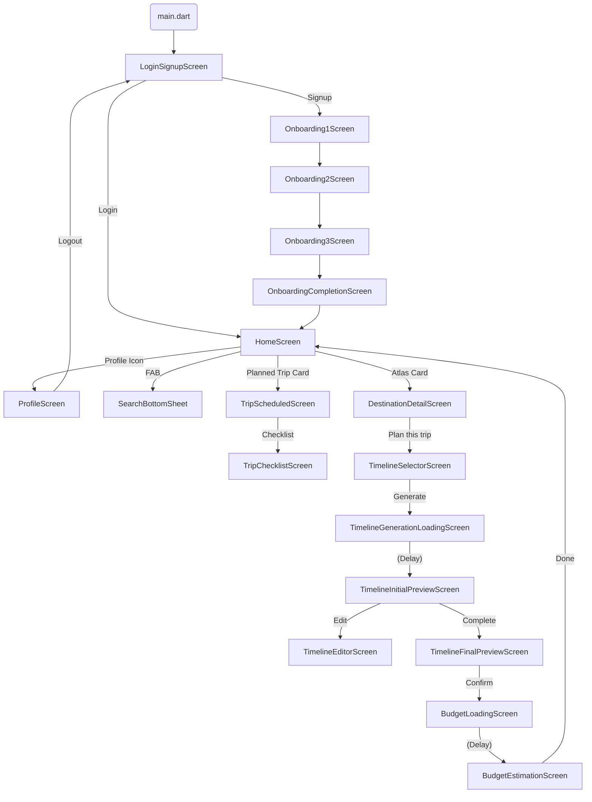

# Itinera

Itinera is a Flutter UI prototype for an intelligent travel-planning experience. It focuses on onboarding, itinerary generation, timeline editing, and budget estimation with a consistent Material 3 design system and custom typography.

## Highlights
- Auth + multi-step onboarding flow
- Home dashboard with planned trips and Atlas discovery cards
- Trip management screens (scheduled/current/completed, checklist)
- Timeline planning flow (date selector, generation, preview, edit, final)
- Budget estimation flow with breakdown and tips
- Material 3 theme and reusable widgets
- Design reference images under `assets/images/stitch_itinera/`

## Tech Stack
- Flutter (SDK >= 3.0.0)
- Material 3
- Custom theme and Roboto Mono font
- Pure UI/mock data (no backend services in this repo)

## Project Structure
```
lib/
  main.dart
  theme/
  screens/
    auth/
    onboarding/
    home/
    trip/
    timeline/
    budget/
  widgets/
assets/
  images/
fonts/
```

## Getting Started
1. Install Flutter and ensure your environment is set up.
2. Fetch dependencies:
   ```bash
   flutter pub get
   ```
3. Run the app:
   ```bash
   flutter run
   ```

Optional: run on a specific device (e.g. Chrome or iOS simulator):
```bash
flutter run -d chrome
```

## Tests
```bash
flutter test
```

## Navigation Flow


## Assets
- Design references: `assets/images/stitch_itinera/`
- App logos: `assets/images/logo_black.png`, `assets/images/logo_white.png`
- Onboarding background: `assets/images/onboarding_bg.jpg`
- Fonts: `fonts/RobotoMono-*.ttf`

## Notes
- Entry point is `lib/main.dart` and the initial screen is `LoginSignupScreen`.
- This repository focuses on UI flows and styling. Data shown in screens is sample data.
