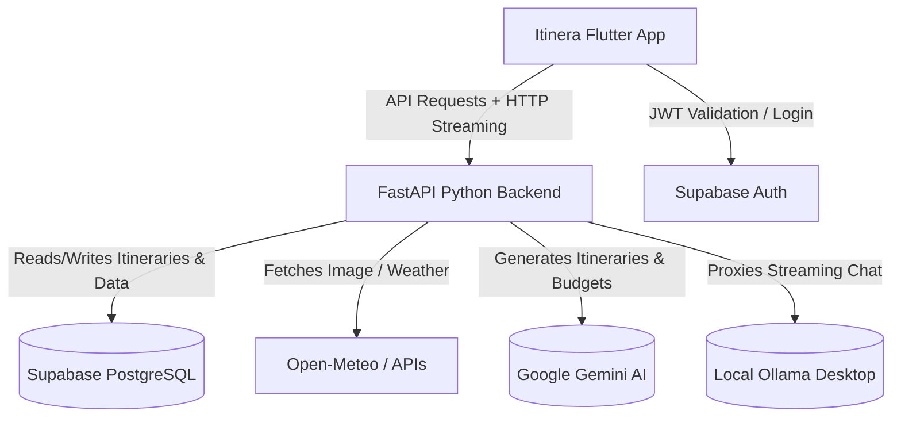
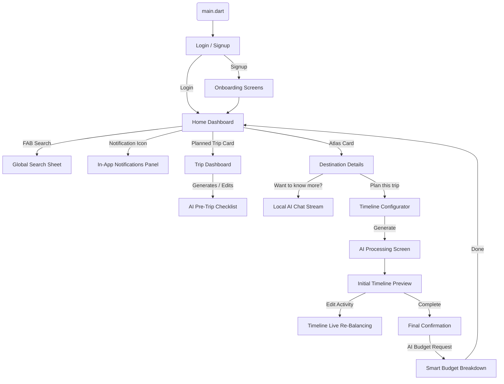
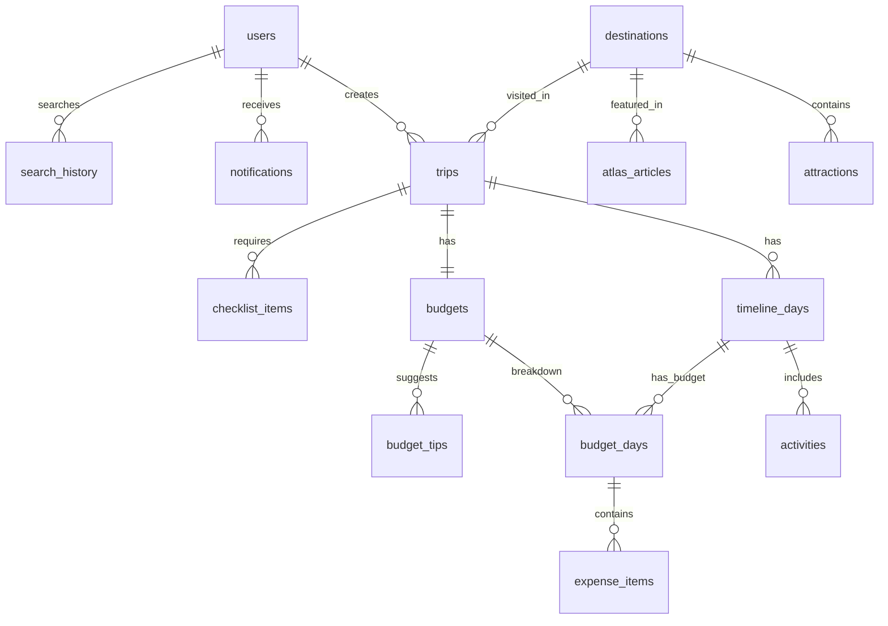

# Itinera (Version 1.0)
The Intelligent AI Travel Ecosystem

Itinera is a premium, beautifully crafted mobile application that transforms chaotic travel research into an orchestrated, singular timeline. Moving far beyond a static UI prototype, the Version 1 build represents a complete, full-stack application leveraging the power of cloud AI (Google Gemini) for heavy logistics, and Edge-AI (Local Ollama) for ultra-fast, local interactions, all bound by a cinematic Flutter frontend and an asynchronous Python backend.

---

## 🌟 V1 Key Highlights

- **Cinematic Auth & Onboarding:** Multi-step fluid onboarding utilizing responsive design, custom `RobotoMono` typography, and Supabase Authentication.
- **The Home Dashboard:** Your customized travel hub featuring dynamic "Atlas" discovery cards, your upcoming intelligently planned trips, and persistent real-time notifications.
- **AI-Powered Timeline Engine:** One-tap trip generation. Itinera maps out day-by-day activities across your destination. It features **dynamic re-balancing**—if you delete or skip an activity, the AI intelligently bridges the gap so your itinerary stays optimized.
- **Local Edge-AI Destination Chat:** A frictionless, floating streaming chat interface embedded natively in the destination page. Powered by a local Ollama model (`gemma4:e4b`), users experience ChatGPT-like real-time streaming tokens with zero cloud latency and total privacy.
- **Financial Intelligence:** Intelligent budget estimation predicting flights, food, transport, and attractions, supporting dual currencies (Local Destination Currency vs. INR).
- **Context-Aware Pre-Trip Checklists:** Itinera analyzes your itinerary activities, local geography, and fetched weather data to automatically craft and organize a personalized packing checklist.
- **Real-time Notifications Architecture:** A dynamic backend pipeline that instantly notifies users when their AI itinerary generations or checklist setups are complete in the background.

---

## 🛠 Technology Stack

### Frontend (Mobile App)
- **Framework:** Flutter (Dart) — SDK >= 3.0.0
- **Design System:** Custom "Cinematic Glassmorphism" aesthetics built on top of Material 3.
- **State Management & Networking:** Native Flutter asynchronous streams, `http` client handling Server-Sent Events (SSE) for AI typing effects.

### Backend (API Server)
- **Framework:** Python + FastAPI + Uvicorn (Fully Asynchronous backend).
- **State & Concurrency:** Stateless HTTP clients ensuring thread-safe Supabase verification preventing "deque mutated" event-loop crashes.

### Database & Authentication
- **Provider:** Supabase (PostgreSQL database, GoTrue Authentication, Row-Level Security).
- **Architecture:** Persistent trip state syncing and notification table pipelines.

### AI Tooling & External APIs
- **Google Gemini Engine:** Powers the complex logical reasoning for Itinerary Structuring, Transport optimization (arrival/flight skip logic), and dynamic Budgets via strict JSON formatting.
- **Local Ollama Integration:** Edge-computing framework operating `gemma4:e4b` locally for offline, private chat features.
- **Live Travel APIs:** 
  - *Open-Meteo* (Weather forecasting integration)
  - *Nominatim* (Geocoding & coordinate tracking)
  - *Unsplash API* (Dynamic heroic imagery fetching)
  - *Wikipedia API* (Initial Atlas data dumps)

---

## 🗺 System Architecture Flow



## 📱 Navigation & App Flow



---

## 🗄 Database Schema (ERD)

The PostgreSQL schema integrates AI outputs intrinsically into standard relational constraints.



---

## 🚀 Getting Started

### 1. Backend Setup
1. Open the terminal and navigate to the backend directory:
   ```bash
   cd backend
   ```
2. Set up your Python virtual environment and install dependencies:
   ```bash
   python -m venv venv
   source venv/bin/activate
   pip install -r requirements.txt
   ```
3. Provide your API Keys in `backend/.env`:
   - `SUPABASE_URL`
   - `SUPABASE_ANON_KEY`
   - `GEMINI_API_KEY`
   - `UNSPLASH_ACCESS_KEY` & `UNSPLASH_SECRET_KEY`
4. Run the API Server:
   ```bash
   python main.py
   ```
*(Note: Ensure your local Ollama Desktop application is running in the background for the Destination Chat feature to operate).*

### 2. Frontend Setup
1. Ensure your Flutter SDK is installed and configured.
2. From the root directory:
   ```bash
   flutter pub get
   ```
3. Run the application on an emulator or real device:
   ```bash
   flutter run
   ```

---
*Built intricately with modern architecture standards, defining the next generation of mobile travel experiences.*
