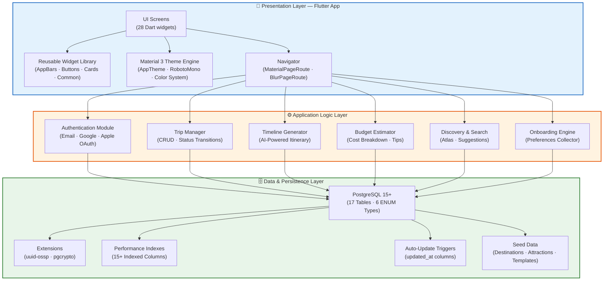
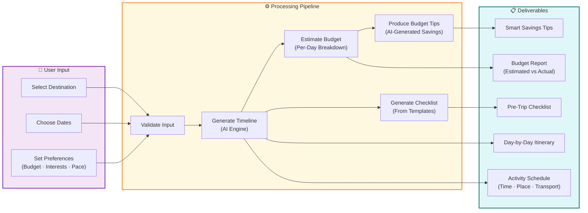
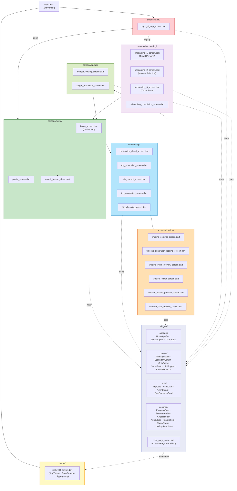
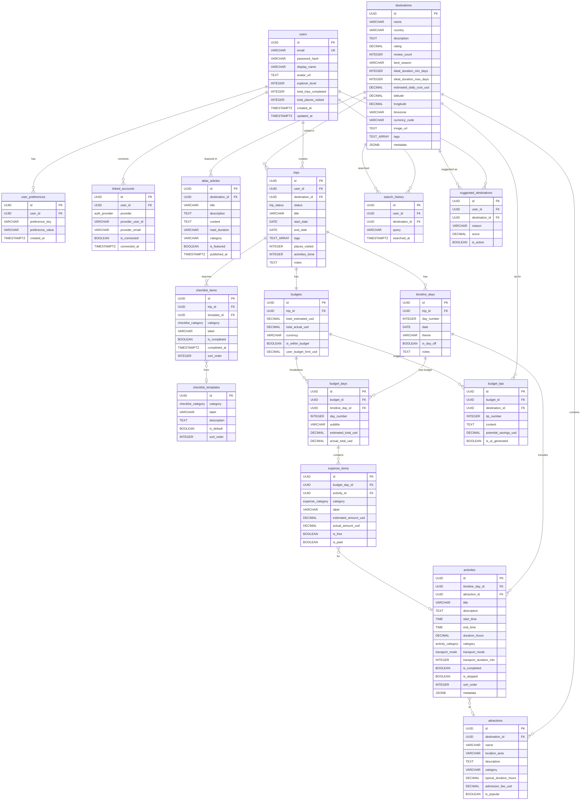
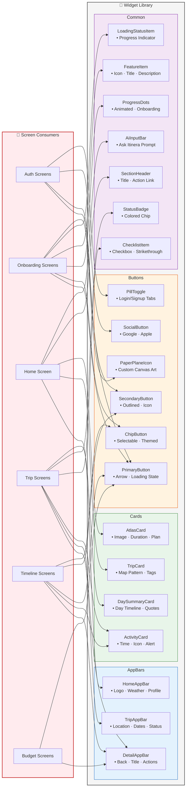
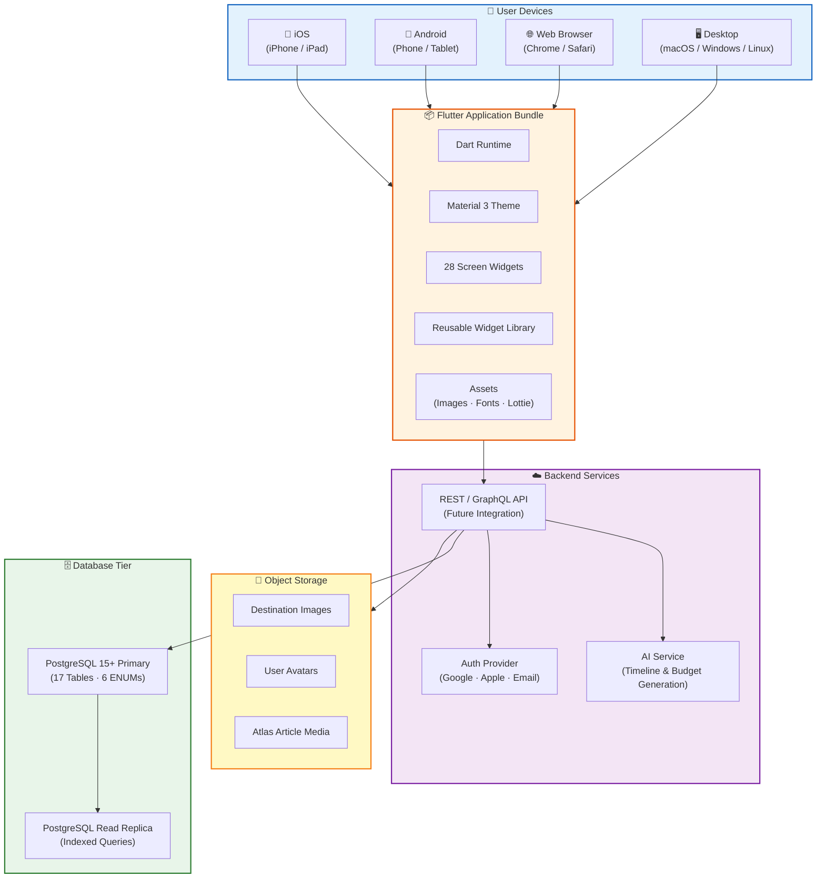

# Itinera — Project Diagrams

> A comprehensive visual documentation of the Itinera travel-planning application covering system architecture, user interactions, data flow, and component design.

---

## Table of Contents

1. [High-Level Architecture Diagram](#1-high-level-architecture-diagram)
2. [Solution Diagram](#2-solution-diagram)
3. [Use-Case Diagram](#3-use-case-diagram)
4. [Component Diagram — Flutter Layer](#4-component-diagram--flutter-layer)
5. [Navigation & Activity Diagram](#5-navigation--activity-diagram)
6. [Trip Planning Activity Diagram](#6-trip-planning-activity-diagram)
7. [Entity-Relationship Diagram](#7-entity-relationship-diagram)
8. [Widget Architecture Diagram](#8-widget-architecture-diagram)
9. [Deployment Diagram](#9-deployment-diagram)

---

## 1. High-Level Architecture Diagram

Shows the overall system architecture with the three major tiers: Presentation (Flutter), Application Logic, and Data Persistence.

---

## 2. Solution Diagram

End-to-end flow showing how a user request travels through the system to produce a complete trip plan.

---

## 3. Use-Case Diagram

All primary actors and their interactions with the system.

```mermaid
graph TB
    subgraph Actors
        Traveler["🧳 Traveler"]
        AI["🤖 AI Engine"]
        Admin["🛠️ System Admin"]
    end

    subgraph AuthUC["Authentication"]
        UC1["Sign Up with Email"]
        UC2["Log In"]
        UC3["OAuth Login<br/>(Google / Apple)"]
        UC4["Log Out"]
    end

    subgraph OnboardUC["Onboarding"]
        UC5["Set Travel Persona"]
        UC6["Select Interests<br/>(Culture · Food · Nature · ...)"]
        UC7["Choose Travel Pace"]
    end

    subgraph TripUC["Trip Management"]
        UC8["Browse Destinations<br/>(Atlas Discovery)"]
        UC9["Search Destinations"]
        UC10["View Destination Details"]
        UC11["Plan a New Trip"]
        UC12["View Scheduled Trip"]
        UC13["Track Current Trip"]
        UC14["Review Completed Trip"]
        UC15["Manage Checklist"]
    end

    subgraph TimelineUC["Timeline Planning"]
        UC16["Select Travel Dates"]
        UC17["Generate Itinerary"]
        UC18["Preview Timeline"]
        UC19["Edit Activities"]
        UC20["Finalize Timeline"]
    end

    subgraph BudgetUC["Budget Estimation"]
        UC21["View Budget Breakdown"]
        UC22["Get Savings Tips"]
    end

    subgraph ProfileUC["Profile"]
        UC23["View Profile & Stats"]
        UC24["Manage Linked Accounts"]
        UC25["Update Preferences"]
    end

    Traveler --> UC1 & UC2 & UC3 & UC4
    Traveler --> UC5 & UC6 & UC7
    Traveler --> UC8 & UC9 & UC10 & UC11 & UC12 & UC13 & UC14 & UC15
    Traveler --> UC16 & UC17 & UC18 & UC19 & UC20
    Traveler --> UC21 & UC22
    Traveler --> UC23 & UC24 & UC25

    AI --> UC17
    AI --> UC21 & UC22

    Admin --> UC8

    style Actors fill:#FFEBEE,stroke:#C62828,stroke-width:2px
    style AuthUC fill:#E8EAF6,stroke:#283593,stroke-width:1px
    style OnboardUC fill:#F3E5F5,stroke:#6A1B9A,stroke-width:1px
    style TripUC fill:#E0F2F1,stroke:#00695C,stroke-width:1px
    style TimelineUC fill:#FFF3E0,stroke:#E65100,stroke-width:1px
    style BudgetUC fill:#FFF9C4,stroke:#F57F17,stroke-width:1px
    style ProfileUC fill:#FCE4EC,stroke:#AD1457,stroke-width:1px
```

---

## 4. Component Diagram — Flutter Layer

Detailed breakdown of the Flutter `lib/` directory and inter-module dependencies.

---

## 5. Navigation & Activity Diagram

Complete screen-to-screen navigation flow showing every route in the application.

```mermaid
graph TD
    Entry["main.dart"] --> Auth["LoginSignupScreen"]

    %% Authentication Flow
    Auth -- "Login" --> Home["HomeScreen"]
    Auth -- "Signup" --> Onb1["Onboarding1Screen<br/>(Travel Persona)"]

    %% Onboarding Flow
    Onb1 --> Onb2["Onboarding2Screen<br/>(Select Interests)"]
    Onb2 --> Onb3["Onboarding3Screen<br/>(Travel Pace)"]
    Onb3 --> OnbComp["OnboardingCompletionScreen<br/>(Profile Setup Loading)"]
    OnbComp --> Home

    %% Home Screen Interactions
    Home -- "Profile Icon" --> Profile["ProfileScreen"]
    Profile -- "Logout" --> Auth
    Home -- "FAB" --> Search["SearchBottomSheet"]

    %% Trip Management
    Home -- "Planned Trip Card" --> TripSched["TripScheduledScreen"]
    Home -- "Current Trip Card" --> TripCurr["TripCurrentScreen"]
    Home -- "Completed Trip Card" --> TripComp["TripCompletedScreen"]
    TripSched -- "Checklist" --> TripCheck["TripChecklistScreen"]

    %% New Trip Planning (The Atlas)
    Home -- "Atlas Card" --> DestDetail["DestinationDetailScreen"]
    DestDetail -- "Plan this trip" --> TimeSel["TimelineSelectorScreen"]
    TimeSel -- "Generate" --> TimeLoad["TimelineGenerationLoadingScreen"]
    TimeLoad -- "(Delay)" --> TimeInit["TimelineInitialPreviewScreen"]

    %% Timeline Editing
    TimeInit -- "Edit" --> TimeEdit["TimelineEditorScreen"]
    TimeEdit -- "Preview Updates" --> TimeUpdate["TimelineUpdatePreviewScreen"]
    TimeUpdate -- "Accept" --> TimeInit
    TimeInit -- "Complete" --> TimeFinal["TimelineFinalPreviewScreen"]

    %% Budget Estimation
    TimeFinal -- "Confirm" --> BudgetLoad["BudgetLoadingScreen"]
    BudgetLoad -- "(Delay)" --> Budget["BudgetEstimationScreen"]
    Budget -- "Done" --> Home

    style Auth fill:#FFCDD2,stroke:#C62828
    style Onb1 fill:#F3E5F5,stroke:#7B1FA2
    style Onb2 fill:#F3E5F5,stroke:#7B1FA2
    style Onb3 fill:#F3E5F5,stroke:#7B1FA2
    style OnbComp fill:#F3E5F5,stroke:#7B1FA2
    style Home fill:#C8E6C9,stroke:#2E7D32
    style Profile fill:#C8E6C9,stroke:#2E7D32
    style Search fill:#C8E6C9,stroke:#2E7D32
    style TripSched fill:#B3E5FC,stroke:#0277BD
    style TripCurr fill:#B3E5FC,stroke:#0277BD
    style TripComp fill:#B3E5FC,stroke:#0277BD
    style TripCheck fill:#B3E5FC,stroke:#0277BD
    style DestDetail fill:#B3E5FC,stroke:#0277BD
    style TimeSel fill:#FFE0B2,stroke:#E65100
    style TimeLoad fill:#FFE0B2,stroke:#E65100
    style TimeInit fill:#FFE0B2,stroke:#E65100
    style TimeEdit fill:#FFE0B2,stroke:#E65100
    style TimeUpdate fill:#FFE0B2,stroke:#E65100
    style TimeFinal fill:#FFE0B2,stroke:#E65100
    style BudgetLoad fill:#DCEDC8,stroke:#558B2F
    style Budget fill:#DCEDC8,stroke:#558B2F
```

---

## 6. Trip Planning Activity Diagram

Detailed activity/state flow for the complete trip planning lifecycle — from discovery to completion.

```mermaid
stateDiagram-v2
    [*] --> Discovery

    state Discovery {
        [*] --> BrowseAtlas
        BrowseAtlas --> SearchDestination
        SearchDestination --> BrowseAtlas
        BrowseAtlas --> ViewDestinationDetail
        SearchDestination --> ViewDestinationDetail
    }

    Discovery --> DateSelection : Plan This Trip

    state DateSelection {
        [*] --> ChooseStartDate
        ChooseStartDate --> ChooseEndDate
        ChooseEndDate --> ReviewDates
    }

    DateSelection --> TimelineGeneration : Generate

    state TimelineGeneration {
        [*] --> AIProcessing
        AIProcessing --> LoadingAnimation
        LoadingAnimation --> TimelineReady
    }

    TimelineGeneration --> TimelineReview

    state TimelineReview {
        [*] --> PreviewItinerary
        PreviewItinerary --> EditActivities
        EditActivities --> PreviewUpdates
        PreviewUpdates --> PreviewItinerary : Accept Changes
        PreviewItinerary --> FinalizeTimeline
    }

    TimelineReview --> BudgetPhase : Confirm Timeline

    state BudgetPhase {
        [*] --> CalculatingBudget
        CalculatingBudget --> BudgetBreakdown
        BudgetBreakdown --> ViewDayExpenses
        ViewDayExpenses --> BudgetBreakdown
        BudgetBreakdown --> ViewSavingsTips
        ViewSavingsTips --> BudgetBreakdown
    }

    BudgetPhase --> TripCreated : Done

    state TripCreated {
        [*] --> PLANNED
        PLANNED --> SCHEDULED : Dates Confirmed
        SCHEDULED --> ACTIVE : Trip Starts
        ACTIVE --> COMPLETED : Trip Ends
        SCHEDULED --> CANCELLED : User Cancels
        PLANNED --> CANCELLED : User Cancels
    }

    TripCreated --> [*]
```

---

## 7. Entity-Relationship Diagram

Complete database schema with all 17 tables, relationships, and key ENUM types.

---

## 8. Widget Architecture Diagram

Reusable widget library taxonomy and which screens consume each widget.

---

## 9. Deployment Diagram

Target deployment architecture for production readiness.

---

## ENUM Types Reference

| ENUM Name | Values |
|-----------|--------|
| `auth_provider` | GOOGLE · APPLE · EMAIL |
| `trip_status` | PLANNED · SCHEDULED · ACTIVE · COMPLETED · CANCELLED |
| `transport_mode` | WALK · TRAIN · TAXI · BUS · SUBWAY · BIKE · CAR |
| `activity_category` | SIGHTSEEING · DINING · SHOPPING · CULTURE · NATURE · ENTERTAINMENT · RELAXATION · ADVENTURE · TRANSPORT · ACCOMMODATION |
| `expense_category` | FLIGHT · TRAIN · TRANSPORT · HOTEL · ACCOMMODATION · FOOD · DINING · ATTRACTION · SHOPPING · INSURANCE · OTHER |
| `checklist_category` | TRAVEL · STAY · ESSENTIALS · DOCUMENTS · HEALTH |

---

## Key Statistics

| Metric | Count |
|--------|-------|
| **Dart Source Files** | 28 |
| **Screen Modules** | 6 (Auth · Onboarding · Home · Trip · Timeline · Budget) |
| **Reusable Widgets** | 17 (across 4 categories) |
| **Database Tables** | 17 |
| **ENUM Types** | 6 |
| **Performance Indexes** | 15+ |
| **Seed Destinations** | 4 (Tokyo · Kyoto · Paris · Bali) |
| **Seed Attractions** | 9 (Tokyo) |
| **Checklist Templates** | 13 (across 5 categories) |

---

*Generated for the Itinera project — an intelligent Flutter travel-planning application.*
